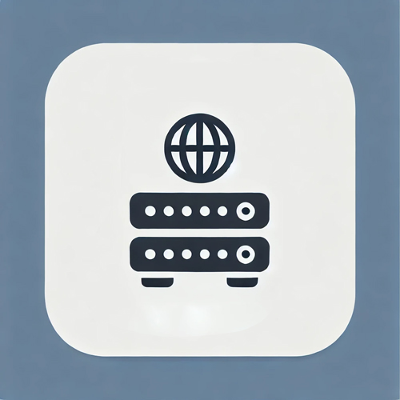

# Simple HTTP Server
###### by Ghost

<p align="center">
  
</p>

## Project Overview

This project is a simple HTTP server implemented in C++ using the Winsock API. The server supports basic HTTP GET and POST requests and can handle static file serving as well as dynamic responses based on query parameters.

## Features
- **HTTP GET Requests**: Serves static files and dynamic content based on the request path.
- **HTTP POST Requests**: Handles POST data and responds accordingly.
- **Static File Serving**: Serves files from a designated static directory.
- **Dynamic Content**: Generates dynamic HTML content based on query parameters.
- **IPv4 Support**: Capable of handling IPv4 addresses.
- **Port Configuration**: Allows the server port to be specified via command line arguments.

## Future Features
This project is meant to be simple for portfolio purposes, however this may expand in scope - TBD. Some features I'd implement next.
- GET/POST interface - allow user to define their own GET/POST functions that works similar to Node.js.
- Middleware support.
- More ..

## Code Structure
- `main.cpp`: Contains the main function, which initializes creates server and calls listen.
- `http_server.h` and `http_server.cpp`: Implements the HTTP server logic, including request parsing, response generation, and static file serving.
- `public/`: Directory containing static files to be served by the server.
- `utils.h` and `utils.cpp`: Contain functions like split, readFile and toLower.
- `log.h` and `log.cpp`: A simple logger system.

## Usage
There are 3 ways you may build the project. You may just compile and build it without running the executable. You may compile, build and run using the -r flag (the default port(8080)). You may compile, build and run using the any defined port by using -r and -p flag.

#### Compile and build
```sh
./build.bat
```

#### Compile, build and run with Default Port
```sh
./build.bat -r
```

#### Compile, build and Run with Specified Port
```sh
./build.bat -r -p 3000
```

## Contributions
Currently not accepting any PRs at the moment. This project is a portfolio project.

## License
This project falls under the MIT license. See the [License](/LICENSE) file for more details.

## Contact
For questions or feedback, please contact contact@jodadev.com.